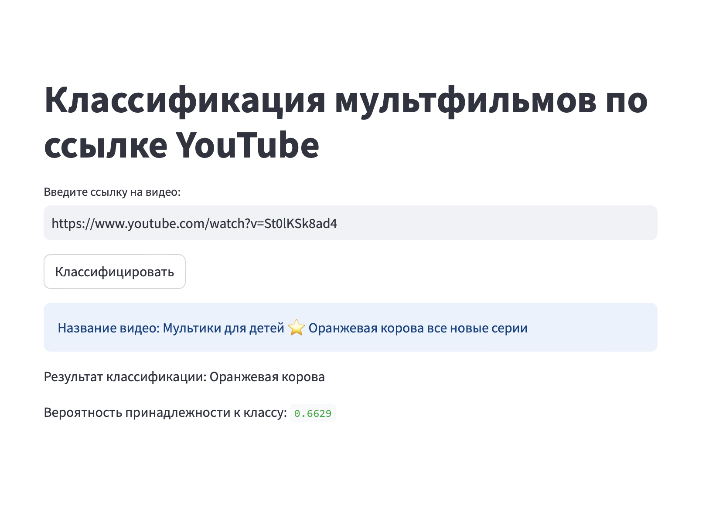

# Классификация мультфильмов по ссылке YouTube

Данный модуль и приложение Streamlit представляют реализацию модели классификации мультфильмов по ссылке на YouTube.

## Замечание

Данная реализация, ввиду отсутствия доступа к API YouTube, использует функции парсинга с использованием библиотеки **Selenium**, которая системно открывает окно браузера (на данный момент настроена интеграция с браузером **Chrome**).

## Установка

1. Склонируйте репозиторий:
   ```bash
   git clone https://github.com/RollingInDeepLearning/SMF_cartoon_classification.git
   cd dir
2. Установите зависимости из файла requirements.txt:
```bash
pip install -r requirements.txt
```
## Запуск

### Способ 1: Запуск через командную строку

В командной строке введите:
```bash
python main.py "ваша ссылка на ролик"
```
Результаты отобразятся в терминале.

### Способ 2: Запуск через Streamlit
  
Запустите приложение Streamlit в командной строке:
```bash
streamlit run app.py
```
Локально по адресу http://localhost:8501/ можно протестировать работу модели.



Примечания
Убедитесь, что у вас установлен Chrome и драйвер ChromeDriver для работы с Selenium.
Для получения информации о видео используется парсинг, поэтому необходимо обеспечить доступ к интернету.

Проект выполнен в рамках Мастерской Яндекс.Practicum
